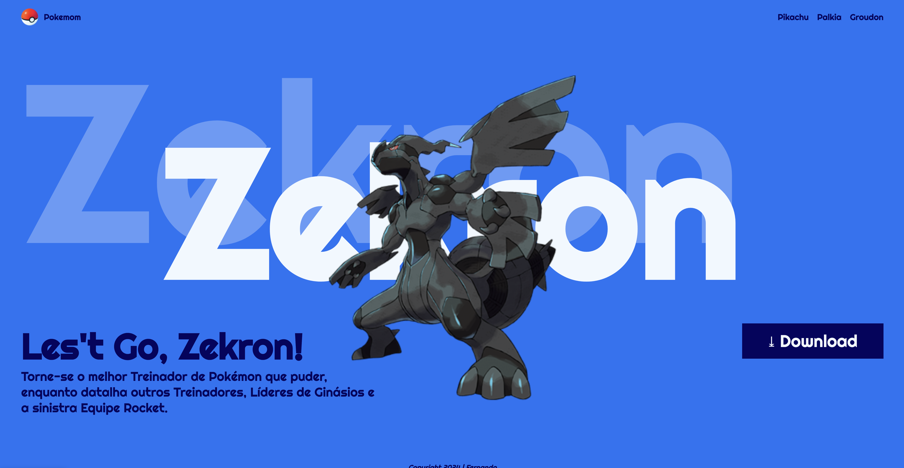

# Landing page - Let's go, Pikachu

---

## sobre
site do tipo landing page para divulgar o jogo let's go pikachu.
o objetivo desse projeto é colocar em prática os conhecimentos adquiridios sobre linguagem de marcação, durante o curso de desenvolvimento de sistemas [SENAI Jandira](https://sp.senai.br/unidade/jandira/) 

--- 

## Tecnologia ultilizadas 
- HTML
- CDD
- Markdown
- Git

---
## Autor
- [Fernando Baliana](https://www.linkedin.com/jobs/)